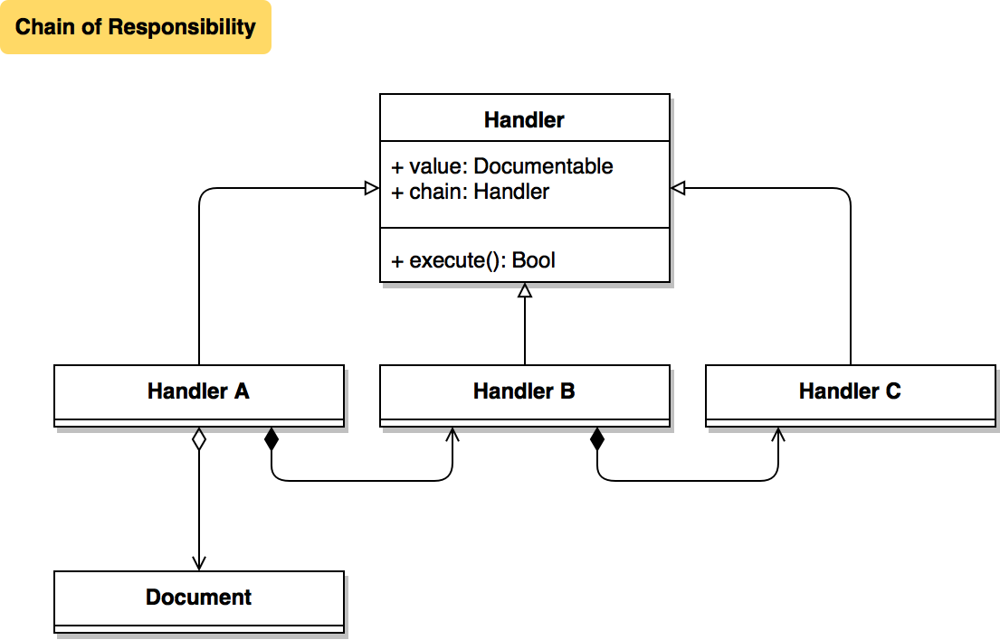

# Chain of Responsibility

[](https://swift.org/blog/swift-4-0-released/)

Behavioral pattern for flexible dependencies execution management

## Class Diagram


## Problem
Weak maintenance of relative processes

## Solution
Link co-dependent parts in unified model

## Usage
```swift
let doc = Agreement()

// create responsables and chain
let c = President()
let b = VicePresident(chain: c)
let a = PrimeMinister(chain: b, value: doc)

// start execution
a.execute()

// Agreement has:
// - signs: [1, 16, 17];
// - addendum hashes: [65484, 65280]
doc.signatures
doc.addendumHashes
```

### Author
Dima Pilipenko, dimpiax@gmail.com

### License
ChainOfResponsibility is available under the MIT license. See the LICENSE file for more info.
