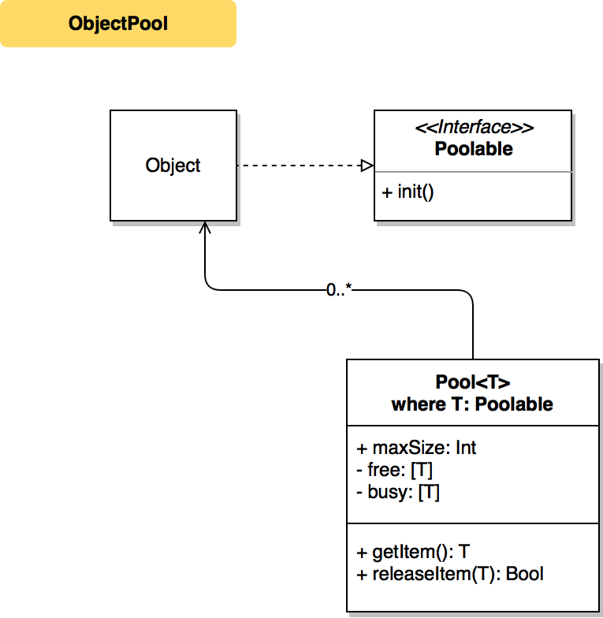

# ObjectPool

[](https://swift.org/blog/swift-4-0-released/)

Creational pattern for memory performance

## Class Diagram


## Problem
Unreasonable creation large amount of data

## Reason
Storing objects in context pool for possible reusing

## Usage
```swift
let pool = Pool<Snowflake>()

// allocate items
let a = pool.getItem()
let b = pool.getItem()
// Pool<Snowflake> busy: 2 free: 0

// release item
pool.releaseItem(b)
// Pool<Snowflake> busy: 1 free: 1
```

## Author
Dima Pilipenko, dimpiax@gmail.com

## License
ObjectPool is available under the MIT license. See the LICENSE file for more info.
