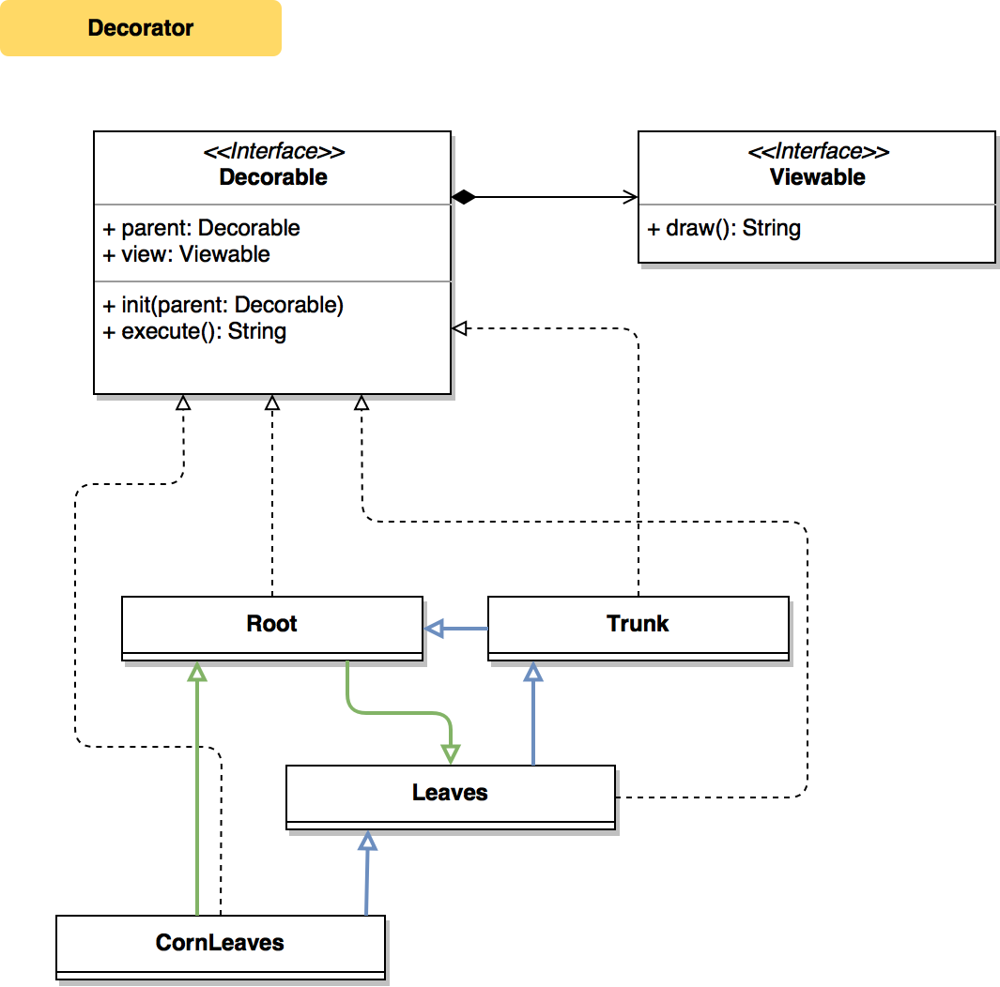

# Decorator

[](https://swift.org/blog/swift-4-0-released/)

Structural pattern for dynamic inheritance

## Class Diagram


## Problem
Static inheritance overuse for similar constructions

## Solution
Dynamic inheritance implementation through composition and unified protocol

## Usage
```swift
let tree = Trunk(parent: Root())

// render items horizontally
Output(separator: "\t|\t", delimiter: " ").print(
    render(tree, title: "A"),
    render(Leaves(parent: tree), title: "B"),
    render(CornLeaves(parent: tree), title: "C"),
    render(CornLeaves(parent: Leaves(parent: tree)), title: "D")
)

/*
Tree variants

A     	|	B     	|	C     	|	D     	|
-     	|	-     	|	-     	|	-     	|
      	|	      	|	      	|	      	|
 \\\\ 	|	 🌿🌿    |	  🌽🌽   |	  🌽🌽    |
/\/\/\	|	 \\\\ 	|	 \\\\ 	|	 🌿🌿  	 |
      	|	/\/\/\	|	/\/\/\	|	 \\\\ 	|
      	|	      	|	      	|	/\/\/\	|
*/
```

### Author
Dima Pilipenko, dimpiax@gmail.com

### License
Decorator is available under the MIT license. See the LICENSE file for more info.
